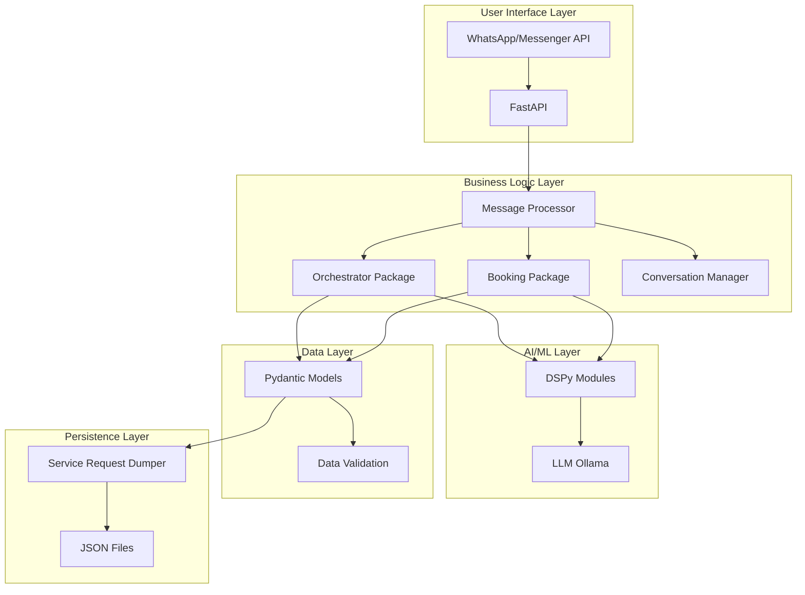
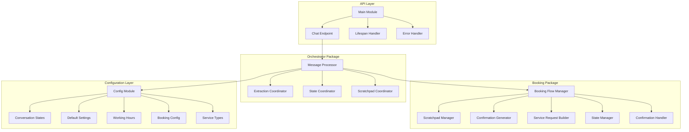
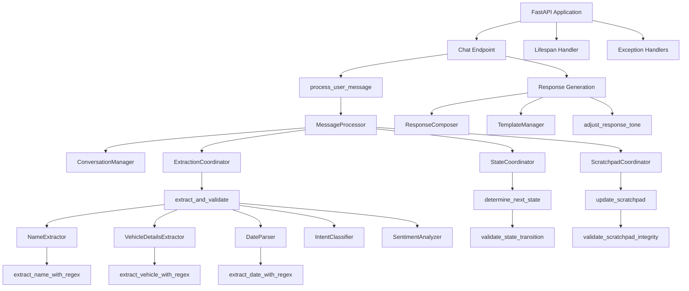
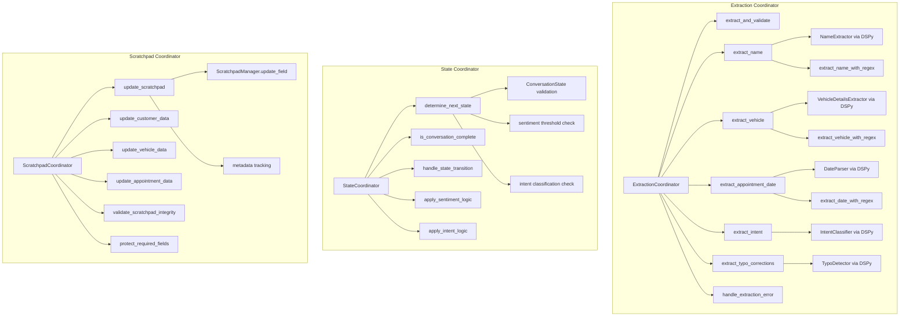
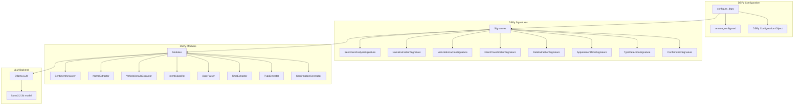
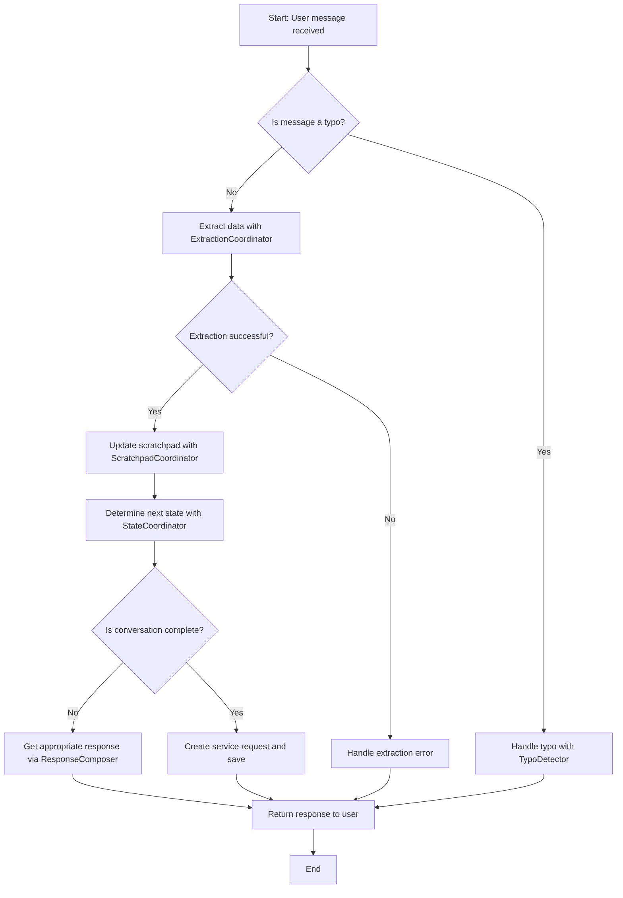
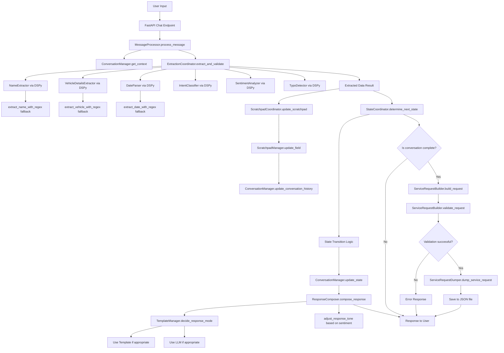
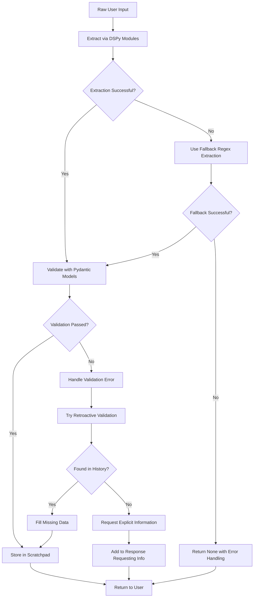
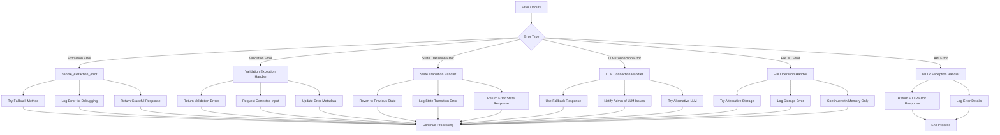

# Chatbot System Architecture Documentation

## Table of Contents
1. [High-Level Design](#high-level-design)
2. [Medium-Level Design](#medium-level-design)
3. [Low-Level Design](#low-level-design)
4. [Component Details](#component-details)
5. [Data Flow](#data-flow)
6. [Error Handling](#error-handling)

## High-Level Design



## Medium-Level Design



## Low-Level Design

### 1. Main Module Architecture



### 2. Orchestrator Package Architecture



### 3. Booking Package Architecture

```mermaid
graph TD
    subgraph "Booking Flow Manager"
        A[BookingFlowManager]
        A --> A1[process_booking_flow]
        A --> A2[integrate_scratchpad]
        A --> A3[integrate_confirmation]
        A --> A4[integrate_state_management]
        A --> A5[integrate_intent_detection]
    end
    
    subgraph "Scratchpad Manager"
        B[ScratchpadManager]
        B --> B1[create_scratchpad]
        B --> B2[update_field]
        B --> B3[get_field]
        B --> B4[validate_scratchpad]
        B --> B5[reset_scratchpad]
        B --> B6[update_metadata]
        
        B2 --> B2a[Field Entry Creation]
        B2 --> B2b[Validation Check]
        B4 --> B4a[ScratchpadForm Validation]
    end
    
    subgraph "Confirmation Generator"
        C[ConfirmationGenerator]
        C --> C1[generate_confirmation]
        C --> C2[format_customer_details]
        C --> C3[format_vehicle_details]
        C --> C4[format_appointment_details]
    end
    
    subgraph "Service Request Builder"
        D[ServiceRequestBuilder]
        D --> D1[build_request]
        D --> D2[validate_request]
    end
    
    subgraph "State Manager"
        E[BookingStateMachine]
        E --> E1[get_current_state]
        E --> E2[transition_state]
        E --> E3[validate_state_transition]
    end
    
    subgraph "Confirmation Handler"
        F[ConfirmationHandler]
        F --> F1[handle_confirmation_action]
        F --> F2[process_edit_action]
        F --> F3[process_confirm_action]
        F --> F4[process_cancel_action]
        F --> F5[handle_typo_detection]
    end
    
    subgraph "Booking Detector"
        G[BookingIntentDetector]
        G --> G1[CONFIRMATION_TRIGGERS]
        G --> G2[detect_booking_intent]
        G --> G3[is_confirmation_intent]
    end
```



### 4. AI/ML Layer Architecture



## Component Details

### 1. Configuration Module (config.py)

#### Variables:
- `DEFAULT_SETTINGS`: Configuration object with default bot settings
- `WORKING_HOURS`: Define working hours for the chatbot
- `BOOKING_CONFIG`: Configuration for booking flow parameters
- `SERVICE_TYPES`: Define available service types for the chatbot

#### Enums:
- `ConversationState`: Define all possible conversation states in the chatbot
  - `ENTRY_POINT`
  - `NAME_COLLECTION`
  - `VEHICLE_COLLECTION`
  - `DATE_COLLECTION`
  - `APPOINTMENT_COLLECTION`
  - `INTENT_DETECTION`
  - `CONFIRMATION`
  - `COMPLETED`
  - `ERROR`
  - `HELP`
  - `FEEDBACK`

#### Functions:
```python
# Configuration module structure
class ConversationState(Enum):
    ENTRY_POINT = "entry_point"
    NAME_COLLECTION = "name_collection"
    VEHICLE_COLLECTION = "vehicle_collection"
    DATE_COLLECTION = "date_collection"
    APPOINTMENT_COLLECTION = "appointment_collection"
    INTENT_DETECTION = "intent_detection"
    CONFIRMATION = "confirmation"
    COMPLETED = "completed"
    ERROR = "error"
    HELP = "help"
    FEEDBACK = "feedback"
```

### 2. Models (models.py)

#### Validation Models:
- `ValidatedCustomer`: Pydantic model for validated customer data
- `ValidatedVehicle`: Pydantic model for validated vehicle data
- `ValidatedAppointment`: Pydantic model for validated appointment data
- `ValidatedSentimentScores`: Pydantic model for validated sentiment scores
- `ValidatedIntent`: Pydantic model for validated intent classification
- `ValidatedConversationContext`: Pydantic model for validated conversation context
- `ExtractionMetadata`: Pydantic model for extraction metadata
- `ValidatedServiceRequest`: Pydantic model for validated service request

#### Validation Logic:
```python
# Example of validation model structure
class ValidatedCustomer(BaseModel):
    first_name: str
    last_name: str
    phone: str  # with phone validation regex
    
    # Validation logic:
    # - Ensure first_name and last_name are not empty
    # - Validate phone number format
    # - Check for potential data corruption (e.g., vehicle names as customer names)

class ValidatedVehicle(BaseModel):
    vehicle_brand: str
    vehicle_model: str
    vehicle_plate: str
    
    # Validation logic:
    # - Check if vehicle_brand and model exist in predefined list
    # - Validate vehicle_plate format
    # - Handle typos in vehicle information
```

### 3. Main Message Processing Flow

#### High-Level Process:
```python
# 1. Entry point: chat endpoint
async def chat(request: Request):
    # Extract message from request
    user_input = extract_input_from_request(request)
    
    # Process message through orchestrator
    response = await process_user_message(user_input)
    
    # Return response
    return {"response": response}

# 2. Message processing function
async def process_user_message(user_input: str):
    # Create message processor instance
    processor = MessageProcessor()
    
    # Process the message and get response
    response = await processor.process_message(user_input)
    
    return response
```

#### Detailed Algorithm Flow:


### 4. Orchestrator Package Detailed Logic

#### MessageProcessor Class:
```python
class MessageProcessor:
    def __init__(self):
        self.extraction_coord = ExtractionCoordinator()
        self.state_coord = StateCoordinator()
        self.scratchpad_coord = ScratchpadCoordinator()
        self.conversation_mgr = ConversationManager()
        self.response_composer = ResponseComposer()
        self.template_mgr = TemplateManager()
    
    async def process_message(self, user_input: str):
        # 1. Retrieve conversation context
        context = self.conversation_mgr.get_conversation_context()
        
        # 2. Extract and validate all data
        extraction_result = await self.extraction_coord.extract_and_validate(
            user_input, 
            context
        )
        
        # 3. Update scratchpad with extracted data
        self.scratchpad_coord.update_scratchpad(
            extraction_result, 
            context.current_state
        )
        
        # 4. Determine next state based on extraction and current state
        next_state = self.state_coord.determine_next_state(
            extraction_result, 
            context.current_state
        )
        
        # 5. Update conversation state
        self.conversation_mgr.update_state(next_state)
        
        # 6. Generate appropriate response
        response = self.response_composer.compose_response(
            user_input,
            extraction_result,
            next_state,
            context
        )
        
        # 7. Save updated context
        self.conversation_mgr.save_conversation_context()
        
        return response
```

#### ExtractionCoordinator Logic:
```python
class ExtractionCoordinator:
    def __init__(self):
        self.name_extractor = NameExtractor()
        self.vehicle_extractor = VehicleDetailsExtractor()
        self.date_parser = DateParser()
        self.intent_classifier = IntentClassifier()
        self.sentiment_analyzer = SentimentAnalyzer()
        self.typo_detector = TypoDetector()
    
    async def extract_and_validate(self, user_input: str, context: Any):
        result = {}
        
        # Extract name
        try:
            name_result = await self.extract_name(user_input, context)
            result['name'] = name_result
        except Exception as e:
            result['name'] = await self.handle_extraction_error(e, user_input, 'name')
        
        # Extract vehicle
        try:
            vehicle_result = await self.extract_vehicle(user_input, context)
            result['vehicle'] = vehicle_result
        except Exception as e:
            result['vehicle'] = await self.handle_extraction_error(e, user_input, 'vehicle')
        
        # Extract appointment date
        try:
            date_result = await self.extract_appointment_date(user_input, context)
            result['appointment_date'] = date_result
        except Exception as e:
            result['appointment_date'] = await self.handle_extraction_error(e, user_input, 'date')
        
        # Extract intent
        intent_result = await self.extract_intent(user_input, context)
        result['intent'] = intent_result
        
        # Extract sentiment
        sentiment_result = await self.sentiment_analyzer.analyze_sentiment(user_input)
        result['sentiment'] = sentiment_result
        
        # Check for typos
        typo_result = await self.typo_detector.detect_typo(user_input)
        result['typos'] = typo_result
        
        # Validate all extracted data
        validated_result = self.validate_extracted_data(result)
        
        return validated_result
    
    # If extraction fails, use regex fallback
    async def extract_name(self, user_input: str, context: Any):
        try:
            # Try DSPy extraction first
            name_result = await self.name_extractor(user_input)
            if name_result and name_result.name:
                return name_result
        except Exception:
            pass
        
        # Fallback to regex extraction
        name_result = self.extract_name_with_regex(user_input)
        return name_result
```

#### StateCoordinator Logic:
```python
class StateCoordinator:
    def __init__(self):
        self.CONFIRMATION_KEYWORDS = ["confirm", "confirmed", "yes", "ok", "proceed", "book"]
    
    def determine_next_state(self, extraction_result: dict, current_state: str):
        # Apply sentiment-based logic
        next_state = self.apply_sentiment_logic(extraction_result, current_state)
        
        # Apply intent-based logic
        next_state = self.apply_intent_logic(extraction_result, next_state)
        
        # Apply standard state transition logic
        if current_state == 'entry_point':
            if extraction_result.get('name'):
                return 'vehicle_collection'
            else:
                return 'name_collection'
        
        elif current_state == 'name_collection':
            if extraction_result.get('name'):
                return 'vehicle_collection'
            else:
                return 'name_collection'  # Stay in name collection
        
        elif current_state == 'vehicle_collection':
            if extraction_result.get('vehicle'):
                return 'date_collection'
            else:
                return 'vehicle_collection'  # Stay in vehicle collection
        
        elif current_state == 'date_collection':
            if extraction_result.get('appointment_date'):
                return 'confirmation'
            else:
                return 'date_collection'  # Stay in date collection
        
        elif current_state == 'confirmation':
            user_input = extraction_result.get('raw_input', '').lower()
            if any(keyword in user_input for keyword in self.CONFIRMATION_KEYWORDS):
                return 'completed'
            else:
                return 'confirmation'  # Stay in confirmation
        
        elif current_state == 'completed':
            return 'completed'  # Stay completed unless reset
        
        # Default: return current state if no transition found
        return current_state if next_state is None else next_state
    
    def apply_sentiment_logic(self, extraction_result: dict, current_state: str):
        sentiment = extraction_result.get('sentiment', {})
        anger_score = sentiment.get('anger', 0)
        
        if anger_score > 7:
            # High anger might require special handling
            if current_state != 'error':
                return 'error'  # Route to error state for special handling
        
        return current_state
    
    def apply_intent_logic(self, extraction_result: dict, current_state: str):
        intent = extraction_result.get('intent', {})
        intent_type = intent.get('intent_type', 'unknown')
        
        if intent_type == 'help':
            return 'help'
        elif intent_type == 'cancel':
            if current_state in ['confirmation', 'completed']:
                return 'entry_point'  # Go back to start
        elif intent_type == 'restart':
            return 'entry_point'  # Always restart from entry point
        
        return current_state
    
    def is_conversation_complete(self, extraction_result: dict, current_state: str):
        # Check if all required fields are present
        required_fields = ['name', 'vehicle', 'appointment_date']
        all_present = all(extraction_result.get(field) for field in required_fields)
        
        # Check if the last user input was a confirmation
        confirmation_keywords = ["confirm", "confirmed", "yes", "ok", "proceed", "book"]
        user_input = extraction_result.get('raw_input', '').lower()
        is_confirmed = any(keyword in user_input for keyword in confirmation_keywords)
        
        # Check that state is at least confirmation
        is_at_confirmation = current_state in ['confirmation', 'completed']
        
        return all_present and is_confirmed and is_at_confirmation
```

### 5. Booking Package Detailed Logic

#### BookingFlowManager:
```python
class BookingFlowManager:
    def __init__(self):
        self.scratchpad_manager = ScratchpadManager()
        self.confirmation_generator = ConfirmationGenerator()
        self.service_request_builder = ServiceRequestBuilder()
        self.state_manager = BookingStateMachine()
        self.confirmation_handler = ConfirmationHandler()
        self.intent_detector = BookingIntentDetector()
    
    async def process_booking_flow(self, user_input: str, current_state: str):
        # 1. Detect booking intent
        booking_intent = self.intent_detector.detect_booking_intent(user_input)
        
        # 2. Update scratchpad based on user input
        if booking_intent:
            self.scratchpad_manager.update_with_user_input(user_input)
        
        # 3. Generate confirmation if needed
        if current_state == 'confirmation':
            confirmation_msg = self.confirmation_generator.generate_confirmation(
                self.scratchpad_manager.get_scratchpad()
            )
            return confirmation_msg
        
        # 4. Handle confirmation actions
        if self.intent_detector.is_confirmation_intent(user_input):
            action = self.confirmation_handler.handle_confirmation_action(user_input)
            return self.process_confirmation_action(action)
        
        # 5. Return current state info
        return self.get_current_booking_status()
    
    def process_confirmation_action(self, action: str):
        if action == 'confirm':
            # Build service request
            service_request = self.service_request_builder.build_request(
                self.scratchpad_manager.get_scratchpad()
            )
            
            # Validate service request
            if self.service_request_builder.validate_request(service_request):
                # Save to file
                self.dump_service_request(service_request)
                return {"status": "completed", "service_request_id": service_request.id}
            else:
                return {"status": "validation_error", "message": "Request validation failed"}
        
        elif action == 'edit':
            return {"status": "editing", "current_scratchpad": self.scratchpad_manager.get_scratchpad()}
        
        elif action == 'cancel':
            self.scratchpad_manager.reset_scratchpad()
            return {"status": "cancelled", "message": "Booking cancelled"}
    
    def dump_service_request(self, service_request: ServiceRequest):
        # Serialize to JSON and save
        import json
        from datetime import datetime
        import os
        
        # Create datadump directory if not exists
        os.makedirs("datadump", exist_ok=True)
        
        # Generate filename with service request ID
        filename = f"datadump/SR-{service_request.id}.json"
        
        # Serialize and save
        with open(filename, 'w') as f:
            json.dump(service_request.dict(), f, indent=2, default=str)
```

#### ScratchpadManager:
```python
class ScratchpadManager:
    def __init__(self):
        self.scratchpad = ScratchpadForm()
        self.metadata = {"created_at": datetime.now(), "updated_at": datetime.now()}
        self.required_fields = ['customer_name', 'vehicle_details', 'appointment_date']
    
    def update_field(self, field_name: str, value: Any):
        # Protect required fields from invalid updates
        if field_name in self.required_fields and not self.is_valid_field_value(value):
            raise ValueError(f"Invalid value for required field {field_name}")
        
        # Update the field
        if hasattr(self.scratchpad, field_name):
            setattr(self.scratchpad, field_name, value)
        
        # Update metadata
        self.update_metadata("updated_at", datetime.now())
    
    def get_field(self, field_name: str) -> Any:
        if hasattr(self.scratchpad, field_name):
            return getattr(self.scratchpad, field_name)
        return None
    
    def validate_scratchpad(self) -> bool:
        # Validate the structure of the scratchpad
        try:
            # This will trigger pydantic validation
            validated = ScratchpadForm(**self.scratchpad.dict())
            return True
        except Exception:
            return False
    
    def reset_scratchpad(self):
        self.scratchpad = ScratchpadForm()
        self.metadata = {"created_at": datetime.now(), "updated_at": datetime.now()}
    
    def update_with_user_input(self, user_input: str):
        # This is a simplified version - in reality, this would use NLP to extract
        # specific pieces of information from the user input
        # and update the appropriate fields in the scratchpad
        pass
    
    def is_valid_field_value(self, value: Any) -> bool:
        # Check if value is not empty or None for required fields
        if value is None:
            return False
        if isinstance(value, str) and not value.strip():
            return False
        return True
```

## Data Flow

### 1. Complete Data Flow Diagram



### 2. Data Validation Flow



## Error Handling

### 1. Comprehensive Error Handling Strategy



### 2. Detailed Error Handling Implementation

#### In Extraction Coordinator:
```python
class ExtractionCoordinator:
    async def extract_and_validate(self, user_input: str, context: Any):
        result = {}
        errors = []
        
        # Name extraction with error handling
        try:
            name_result = await self.extract_name(user_input, context)
            result['name'] = name_result
        except Exception as e:
            error_msg = f"Name extraction failed: {str(e)}"
            errors.append(error_msg)
            logger.error(error_msg)
            
            # Try fallback
            try:
                fallback_result = self.extract_name_with_regex(user_input)
                result['name'] = fallback_result
                logger.info("Name extraction succeeded with fallback method")
            except Exception as fallback_e:
                result['name'] = None
                logger.error(f"Name extraction fallback also failed: {str(fallback_e)}")
        
        # Vehicle extraction with error handling
        try:
            vehicle_result = await self.extract_vehicle(user_input, context)
            result['vehicle'] = vehicle_result
        except Exception as e:
            error_msg = f"Vehicle extraction failed: {str(e)}"
            errors.append(error_msg)
            logger.error(error_msg)
            
            # Try fallback
            try:
                fallback_result = self.extract_vehicle_with_regex(user_input)
                result['vehicle'] = fallback_result
                logger.info("Vehicle extraction succeeded with fallback method")
            except Exception as fallback_e:
                result['vehicle'] = None
                logger.error(f"Vehicle extraction fallback also failed: {str(fallback_e)}")
        
        # Similar error handling for other extractions...
        
        # Store errors in result for downstream processing
        result['extraction_errors'] = errors
        
        # Validate the results
        validated_result = self.validate_extracted_data(result)
        
        return validated_result
    
    def validate_extracted_data(self, data: dict):
        validated_data = {}
        validation_errors = []
        
        # Validate name data
        if data.get('name'):
            try:
                # This uses Pydantic validation
                validated_name = ValidatedCustomer(first_name=data['name'].first_name, last_name=data['name'].last_name, phone=data['name'].phone)
                validated_data['name'] = validated_name
            except Exception as e:
                validation_errors.append(f"Name validation failed: {str(e)}")
                validated_data['name'] = None
        else:
            validated_data['name'] = None
        
        # Similar validation for other data types...
        
        # Add validation errors to result
        validated_data['validation_errors'] = validation_errors
        
        return validated_data
```

#### In Message Processor:
```python
class MessageProcessor:
    async def process_message(self, user_input: str):
        try:
            # Retrieve conversation context
            context = self.conversation_mgr.get_conversation_context()
        except Exception as e:
            logger.error(f"Failed to get conversation context: {str(e)}")
            # Use default context
            context = ValidatedConversationContext(
                current_state=ConversationState.ENTRY_POINT,
                history=[],
                metadata={}
            )
        
        try:
            # Extract and validate data
            extraction_result = await self.extraction_coord.extract_and_validate(
                user_input, 
                context
            )
        except Exception as e:
            logger.error(f"Extraction failed: {str(e)}")
            # Return error response
            return "I'm having trouble understanding your message. Could you please rephrase?"
        
        try:
            # Update scratchpad
            self.scratchpad_coord.update_scratchpad(
                extraction_result, 
                context.current_state
            )
        except Exception as e:
            logger.error(f"Scratchpad update failed: {str(e)}")
            # Continue processing but log the error
        
        try:
            # Determine next state
            next_state = self.state_coord.determine_next_state(
                extraction_result, 
                context.current_state
            )
            
            # Update conversation state
            self.conversation_mgr.update_state(next_state)
        except Exception as e:
            logger.error(f"State transition failed: {str(e)}")
            # Revert to previous state or use default
            next_state = context.current_state
        
        try:
            # Generate response
            response = self.response_composer.compose_response(
                user_input,
                extraction_result,
                next_state,
                context
            )
        except Exception as e:
            logger.error(f"Response composition failed: {str(e)}")
            # Use fallback response
            response = "I'm experiencing technical difficulties. Please try again later."
        
        try:
            # Save updated context
            self.conversation_mgr.save_conversation_context()
        except Exception as e:
            logger.error(f"Failed to save conversation context: {str(e)}")
            # Continue but log the error
        
        return response
```

#### In Main API Handler:
```python
@asynccontextmanager
async def lifespan(app: FastAPI):
    """Handle startup and shutdown of the application."""
    # Startup
    configure_dspy()  # Initialize DSPy
    logger.info("Application started")
    
    yield
    
    # Shutdown
    logger.info("Application shutting down")

# Chat endpoint with error handling
@app.post("/chat")
async def chat(request: Request):
    try:
        # Parse the request to extract user message
        body = await request.json()
        user_input = body.get("message", "").strip()
        
        if not user_input:
            raise HTTPException(status_code=400, detail="Message field is required")
        
        # Process the message
        response = await process_user_message(user_input)
        
        return {"response": response}
    
    except HTTPException:
        # Re-raise HTTP exceptions as they are
        raise
    
    except Exception as e:
        # Log the error
        logger.error(f"Unexpected error in chat endpoint: {str(e)}", exc_info=True)
        
        # Return a user-friendly error message
        return {
            "response": "I'm sorry, but I'm experiencing technical difficulties. Please try again later.",
            "error": "internal_error"
        }

# Global exception handler
@app.exception_handler(RequestValidationError)
async def validation_exception_handler(request: Request, exc: RequestValidationError):
    logger.error(f"Validation error: {exc}")
    return JSONResponse(
        status_code=422,
        content={"detail": exc.errors(), "response": "Invalid request format"}
    )
```

### 3. Business Logic Error Handling

In addition to technical errors, the system handles business logic errors:

#### Booking Flow Errors:
```python
def process_booking_flow(self, user_input: str, current_state: str):
    try:
        # Check for conflicting appointments
        if current_state == 'date_collection':
            appointment_date = extract_date_from_input(user_input)
            if appointment_date and is_slot_booked(appointment_date):
                return "I'm sorry, that time slot is already booked. Would you like to choose another time?"
        
        # Check for invalid vehicle information
        if current_state == 'vehicle_collection':
            vehicle_info = extract_vehicle_from_input(user_input)
            if vehicle_info and not is_valid_vehicle(vehicle_info):
                return "I couldn't recognize that vehicle. Please enter a valid brand and model."
        
        # Continue with normal flow
        # ... rest of the processing
        
    except ValueError as e:
        # Handle specific business logic errors
        return f"I couldn't process that information: {str(e)}. Could you please clarify?"
    
    except Exception as e:
        # Handle unexpected errors
        logger.error(f"Error in booking flow: {str(e)}", exc_info=True)
        return "I'm having trouble processing your booking. Please try again or contact support."
```

This comprehensive system architecture document covers the high-level design, medium-level components, low-level implementations, detailed data flows, and error handling strategies for the entire chatbot system. All components, variables, logic flows, and exception handling mechanisms are documented with Mermaid diagrams for visual representation.